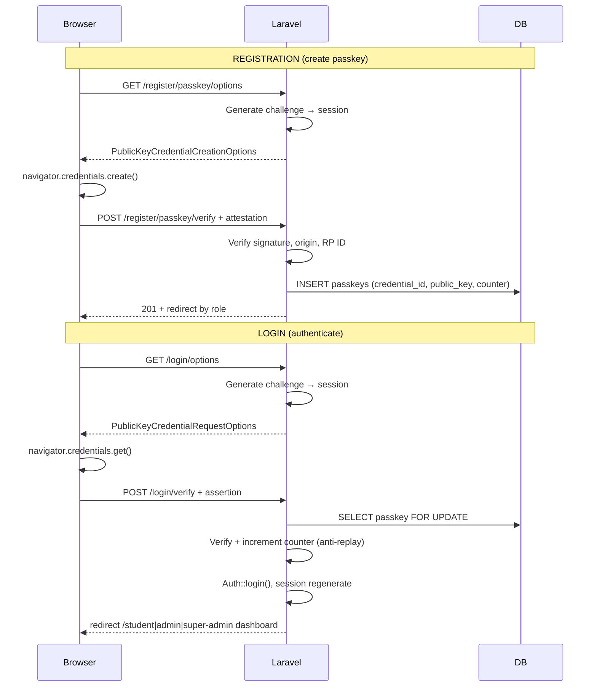

# School Portal — Passkey (WebAuthn / FIDO2) Authentication

Production-ready passwordless authentication for the **School Voting System**, built on:

- **Laravel 12** (backend)
- **`laravel/passkeys`** → **webauthn-framework** (PHP, cryptographic verification)
- **Vanilla JavaScript** + native `navigator.credentials` API

Private keys **never** leave the user's device. Only **public keys** and metadata are stored server-side.

---

## Authentication flow diagram



---

## Step-by-step

### 1. Registration (create passkey)

| Step | Who | Action |
|------|-----|--------|
| 1 | Student | Submits account form at `GET/POST /register` (name, email, student_id — **no password**) |
| 2 | Server | Creates `users` row with `role = student` |
| 3 | Server | Redirects to **signed** enrollment URL `/enroll/passkey/{user}` |
| 4 | Browser | `GET /enroll/passkey-options` → challenge stored in `session['passkey.registration_options']` |
| 5 | Browser | `navigator.credentials.create({ publicKey })` |
| 6 | Browser | `POST /enroll/passkey-verify` with attestation payload |
| 7 | Server | `StorePasskey` validates via webauthn-framework, saves `passkeys` row |
| 8 | Server | Logs user in, redirects to role dashboard |

**Admins / super admins** are provisioned by seeders or staff tools, then use:

```bash
php artisan portal:enrollment-link ADMIN-001
```

### 2. Login (authentication)

| Step | Action |
|------|--------|
| 1 | User clicks **Login with Passkey / Fingerprint** on `/` |
| 2 | `GET /login/options` → authentication challenge in session |
| 3 | `navigator.credentials.get({ publicKey })` |
| 4 | `POST /login/verify` with signed assertion |
| 5 | `VerifyPasskey` checks signature, **updates counter** (clone detection) |
| 6 | Session created; redirect by role |

### 3. Role redirect switchboard

| Role | Dashboard |
|------|-----------|
| `student` | `/student/dashboard` |
| `admin` | `/admin/dashboard` |
| `super admin` | `/super-admin/dashboard` |

Implemented in `App\Services\Auth\RoleRedirectService`.

---

## Database schema

### `users`

| Column | Notes |
|--------|-------|
| `id` | PK |
| `student_id` | Unique portal identifier |
| `name`, `email` | Profile |
| `role` | `student`, `admin`, `super admin` |
| `password` | **NULL** (passkey-only) |

### `passkeys`

| Column | Notes |
|--------|-------|
| `id` | PK |
| `user_id` | FK → `users.id`, indexed, cascade delete |
| `credential_id` | Unique, base64url credential id |
| `credential` | JSON blob required by webauthn-framework (includes COSE public key) |
| `public_key` | Denormalized extract for auditing / reporting |
| `counter` | Signature counter — **must increase** each login (replay protection) |
| `device_name` | Human label ("School Laptop", "iPhone") |
| `created_at`, `updated_at` | Timestamps |

> Private keys are **never** stored.

---

## API routes

### Guest

| Method | URI | Controller | Purpose |
|--------|-----|------------|---------|
| GET | `/` | `PasskeyAuthController@showLogin` | Login UI |
| GET | `/login/options` | `loginOptions` | Auth challenge |
| POST | `/login/verify` | `loginVerify` | Verify assertion |
| GET | `/register` | `PortalRegistrationController@create` | Signup form |
| POST | `/register` | `PortalRegistrationController@store` | Create user |
| GET | `/login/recovery` | `PasskeyRecoveryController@show` | Recovery UI |
| POST | `/login/recovery` | `requestReset` | Request admin help |
| GET | `/enroll/passkey/{user}` | `PasskeyBootstrapController@show` | First passkey (**signed URL only**) |
| GET | `/enroll/passkey-options` | `registerOptions` | Enrollment challenge (session `passkey.bootstrap_user_id`) |
| POST | `/enroll/passkey-verify` | `registerVerify` | Save passkey (same session; not signed) |

### Authenticated

| Method | URI | Purpose |
|--------|-----|---------|
| GET | `/dashboard` | Role switchboard |
| GET | `/register/passkey/options` | Add another device |
| POST | `/register/passkey/verify` | Save device |
| GET | `/user/passkeys` | List devices (JSON) |
| DELETE | `/user/passkeys/{passkey}` | Revoke device |
| POST | `/admin/users/{user}/passkey-reset` | Admin enrollment link |

---

## Security controls

| Control | Implementation |
|---------|----------------|
| HTTPS in production | `EnsurePasskeySecureContext` middleware |
| Unique challenge per request | Session-stored options, **pulled** on verify (one-time use) |
| Origin / RP ID validation | `config/passkeys.php` → `allowed_origins`, `relying_party_id` |
| Replay protection | Monotonic `counter` per credential |
| Rate limiting | `throttle` on login/register endpoints |
| No private key storage | WebAuthn design + server only stores public material |
| Account enumeration safe recovery | Generic message on recovery form |
| CSRF | Laravel session + `X-CSRF-TOKEN` on POST |
| DB atomicity | `DB::transaction()` on verify/store |

### `.env` (required for WebAuthn)

```env
APP_URL=https://your-school-portal.edu.ph
PASSKEYS_RELYING_PARTY_ID=your-school-portal.edu.ph
PASSKEYS_ALLOWED_ORIGINS=https://your-school-portal.edu.ph
```

Local development must use **full origins** (scheme + host + port), for example:

```env
APP_URL=http://localhost:8000
PASSKEYS_RELYING_PARTY_ID=localhost
PASSKEYS_ALLOWED_ORIGINS=http://localhost:8000
```

Host-only values like `127.0.0.1` are auto-expanded using `APP_URL`, but explicit URLs are recommended.

---

## Frontend JavaScript

| File | Purpose |
|------|---------|
| `resources/js/passkey-helpers.js` | Base64URL ↔ ArrayBuffer |
| `resources/js/passkey-auth.js` | Login ceremony |
| `resources/js/passkey-register.js` | Registration ceremony |
| `resources/js/passkey-devices.js` | List / remove devices |
| `resources/js/passkey-recovery.js` | Recovery form |

---

## Extra features

### Multiple devices

- Users register additional passkeys from **Profile → Passkey devices** or dashboard CTA.
- Each device = one row in `passkeys`.

### Register new device

- Component: `resources/views/components/passkey-register.blade.php`
- Calls `register.passkey.options` + `register.passkey.verify`.

### Fallback recovery

1. User submits Student ID + email at `/login/recovery`.
2. Admin runs `php artisan portal:enrollment-link {student_id}` **or** `POST /admin/users/{user}/passkey-reset`.
3. User opens signed link and registers a new passkey.

---

## Test cases (manual QA)

| # | Scenario | Expected |
|---|----------|----------|
| 1 | Register new student + passkey | Redirect to student dashboard; passkey row exists |
| 2 | Login with registered passkey | Session created; correct dashboard |
| 3 | Login without passkey | 422 — passkey not recognized |
| 4 | Reuse old challenge | 422 — session expired |
| 5 | Register second device | Two `passkeys` rows |
| 6 | Remove device (2+ exist) | Device deleted |
| 7 | Remove last device | 422 — must keep one |
| 8 | Admin login | `/admin/dashboard` |
| 9 | Super admin login | `/super-admin/dashboard` |
| 10 | Recovery form | Generic success message |

---

## Quick start (local)

```bash
php artisan migrate
php artisan db:seed --class=PortalUserSeeder
php artisan portal:enrollment-link 2026-00001
# Open printed URL → register passkey → visit http://localhost:8000
npm run build
php artisan serve
```

---

## Key files

```
app/Http/Controllers/Auth/PasskeyAuthController.php
app/Http/Controllers/Auth/PortalRegistrationController.php
app/Http/Controllers/Auth/PasskeyDeviceController.php
app/Http/Controllers/Auth/PasskeyRecoveryController.php
app/Models/Passkey.php
app/Models/User.php
app/Actions/Passkeys/StorePasskeyCredential.php
app/Actions/Passkeys/VerifyPasskeyCredential.php
resources/views/auth/login.blade.php
resources/js/passkey-auth.js
routes/web.php
config/passkeys.php
```
